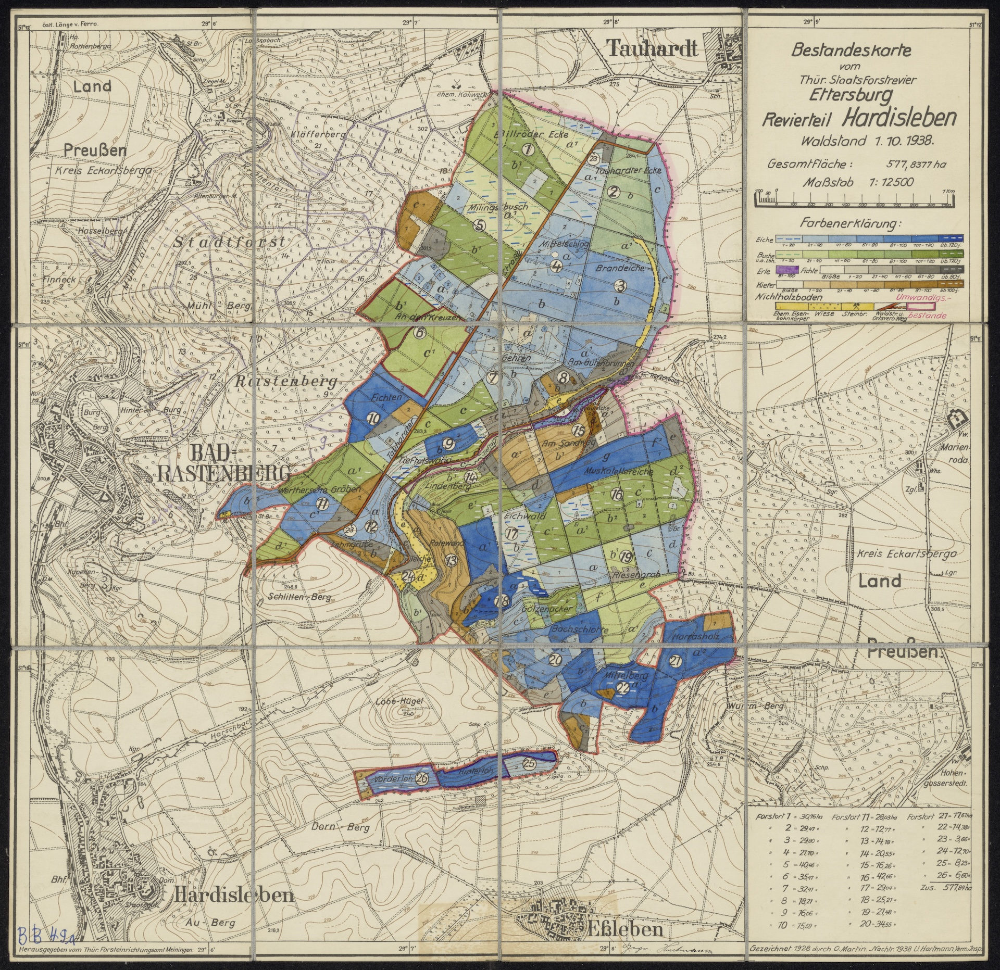
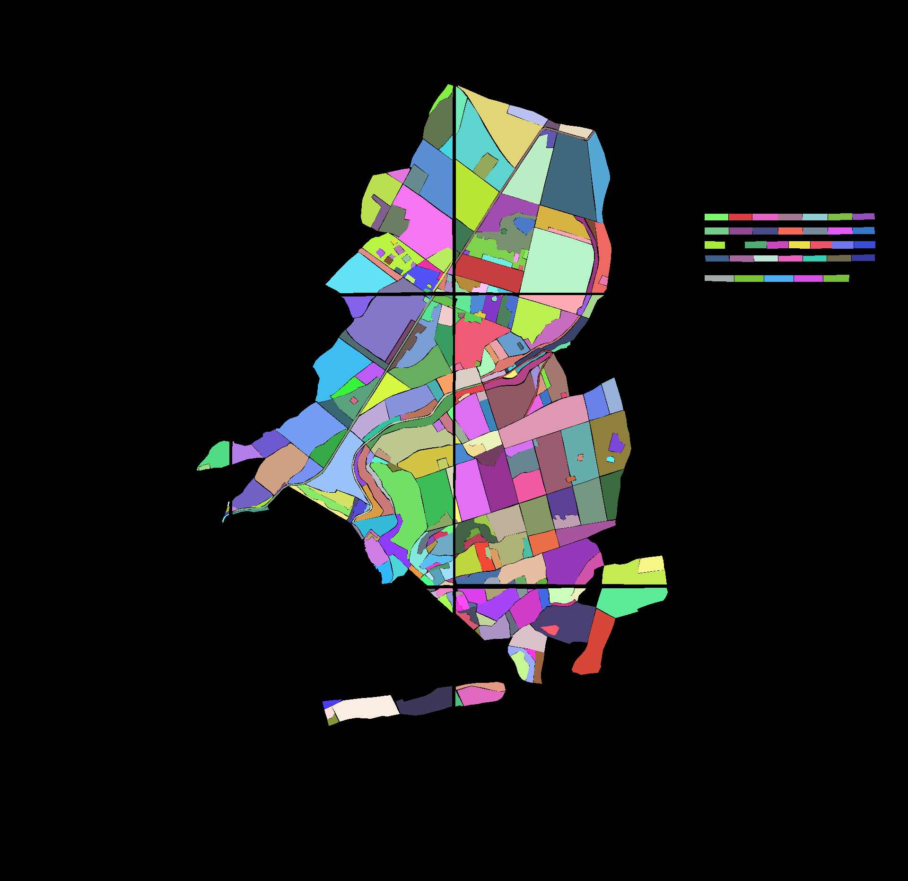

# Historical Forest Map Instance Segmentation

[](https://docs.ultralytics.com/)
[](https://opensource.org/licenses/MIT)

Official PyTorch implementation of **"Enhancing instance segmentation on limited-annotated historical maps via pseudo-labeling"**.

---

## 🎯 Task & Dataset Example

Historical map archives typically lack standardized legends and consistent cartographic styles, making automated digitization particularly challenging. To address this issue, our framework treats each target region across the entire map sheet as an individual instance for end-to-end model training. The following shows a sample map sheet along with its corresponding instance-level ground truth target:

<p align="center">
  
  
</p>
<p align="center">
  <em>Original scanned historical map (Left) vs. Target ground truth instance mask (Right) (Hardisleben_1938)</em>
</p>

---

## 🎛️ Pseudo-Labeling Strategies

To train models, this framework leverages pseudo-labeling on unlabeled historical map sheets. When provided with a dataset containing both annotated and unlabeled map sheets, pseudo-labels are generated and filtered using two confidence mechanisms:

- **Object-level (Strategy-O):** An image tile (patch) is accepted into training if it contains **at least one** predicted object exceeding the confidence threshold.
- **Patch-level (Strategy-P):** An image tile (patch) is accepted into training **only if all** predicted objects exceed the confidence threshold.

You can select the strategy via the `--strategy` flag in `train.py`:

<table>
  <thead>
    <tr>
      <th width="22%">Strategy Flag</th>
      <th width="18%">Strategy Name</th>
      <th width="22%">Unlabeled Data Used?</th>
      <th>Description</th>
    </tr>
  </thead>
  <tbody>
    <tr>
      <td><code>--strategy none</code></td>
      <td>Baseline</td>
      <td>❌ No</td>
      <td>Fully-supervised training on manual annotations.</td>
    </tr>
    <tr>
      <td><code>--strategy object</code></td>
      <td>Strategy-O</td>
      <td>✅ Yes</td>
      <td>Retains patches with any high-confidence instance candidates.</td>
    </tr>
    <tr>
      <td><code>--strategy patch</code></td>
      <td>Strategy-P</td>
      <td>✅ Yes</td>
      <td>Retains patches only when all instance candidates pass the threshold.</td>
    </tr>
  </tbody>
</table>

---

## 🚀 Quick Start

### 1. Installation
Clone the repository and set up the Python environment:
```bash
git clone https://github.com/Riceton1024/historical-forest-map-segmentation.git
cd historical-forest-map-segmentation

python -m venv .venv
source .venv/bin/activate  # On Windows: .venv\Scripts\activate
pip install -r requirements.txt
```
### 2. Preprocess & Tile Map Archives
Crop high-resolution historical map sheets into $896 \times 896$ tiles for training:
```bash
python src/dataset.py --images-dir demo_data/images --labels-dir demo_data/labels --output-dir data
```
### 3. Model Training
Semi-supervised training follows a two-stage Teacher-Student pipeline:

#### Step 3a: Train Baseline Teacher Model
Train a baseline teacher model using manual annotations only (--strategy none):
```bash
python train.py \
  --strategy none \
  --name exp_teacher \
  --epochs 100 \
  --batch-size 8
```

#### Step 3b: Train Student Model with Pseudo-Labeling
Generate pseudo-labels from unlabeled map sheets using trained teacher weights with either Strategy-O (--strategy object) or Strategy-P (--strategy patch), then train the student model:
```bash
python train.py \
  --strategy object \
  --teacher-weights results/exp_teacher/weights/best.pt \
  --unlabeled-dir demo_data/unlabeled_images \
  --conf-thresh 0.25 \
  --name exp_student \
  --epochs 100 \
  --batch-size 8
```

### 4. Evaluate & Stitch Whole Maps
Run tile-based inference, reconstruct full-map spatial segmentation, and generate evaluation reports:
```bash
python evaluate.py \
  --model results/exp_student/weights/best.pt \
  --images-dir demo_data/images \
  --labels-dir demo_data/labels \
  --output-txt results/eval_report.txt
```

---

## 📂 Repository Structure

```text
historical-forest-map-segmentation/
├── demo_data/                    # Sample historical map sheets & YOLO polygon labels
│   ├── images/                   
│   ├── labels/                   
│   └── unlabeled_images/         
├── src/                          
│   ├── dataset.py                # Map tiling & coordinate normalization engine
│   ├── pseudo_label.py           # Dual-strategy pseudo-label generators 
│   └── metrics.py                
├── data.yaml                     
├── train.py                      # Self-training execution pipeline
├── evaluate.py                   # Whole-map reconstruction & reporter
├── requirements.txt             
└── README.md                     
```
---

## 🤝 Acknowledgments

This research was supported by the **iDiv Flexpool**. We thank the **Forest Research and Competence Center Gotha (FFK Gotha)** for providing the historical maps, the **Thuringian University and State Library Jena (ThULB Jena)** for digitization, and our student assistants for dataset annotation.

> **Note:** Paper citation details will be updated upon official publication.

---

## 📜 License

This project is licensed under the [MIT License](LICENSE).

